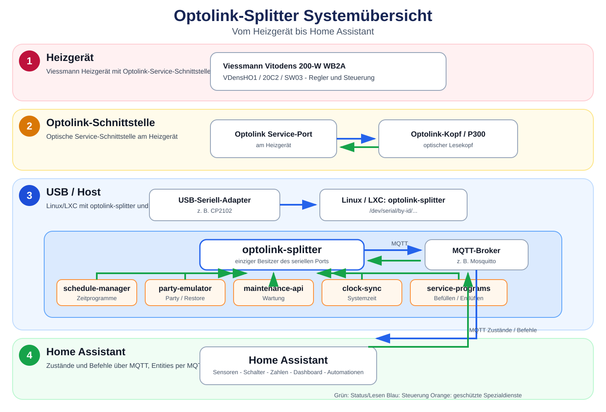
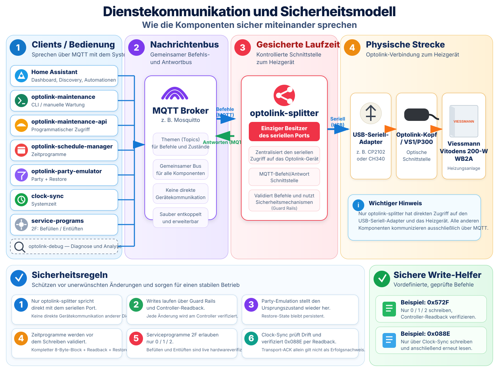

# Optolink-Splitter + Home Assistant

This branch is the **production branch** for the local Optolink-Splitter deployment.

It deliberately contains only the components required to operate the splitter with the validated VDensHO1 / 20C2 Home Assistant integration. Firmware reverse engineering, EEPROM/KBus experiments, one-off probes, data captures and Optolink-Web are intentionally excluded.

## Dokumentation

Für einen neuen Maintainer ist diese Reihenfolge gedacht:

0. [Dokumentationsindex](docs/README.md) — Übersicht und Quellen der Wahrheit.
1. [Architektur](docs/architecture.md) — Komponenten, Datenfluss, Sicherheitsgrenzen und Deployment-Kette.
2. [Betrieb / Runbook](docs/operations.md) — Update, Statuschecks, Logs, Troubleshooting und Rollback.
3. [Home Assistant](docs/home-assistant.md) — Poll-Profil, MQTT-Entities, Schreibpfade und Dashboard-Modell.
4. [Entwicklungsleitfaden](docs/development.md) — Regeln für neue Reads/Writes, CI und Hardware-Verifikation.
5. [Wartung](docs/optolink-maintenance.md) und [Wartungs-API](docs/optolink-maintenance-api.md).
6. [WB2A-Zeitprogrammblöcke](docs/wb2a-schedule-blocks.md).
7. [WB2A-Anlagenschema und Anlagenkonfiguration](docs/anlagenschema.md).
8. [VControl-/Adress-Mapping](config/optolink-splitter/vcontrol-mapping.md).

Kurzfassung des Laufzeitpfads:

```text
Home Assistant
      |
      v
 MQTT Broker <---- Zusatzdienste (Schedule / Party / Maintenance / Clock)
      |
      v
optolink-splitter
      |
      v
serieller Optolink-Adapter
      |
      v
Vitodens 200-W WB2A
```

Der Splitter ist der einzige produktive Besitzer des seriellen Ports. Zusatzdienste kommunizieren über seine MQTT-Befehls-/Antwortschnittstelle.

## Systemübersicht





Die Diagramme liegen als SVG im Repository und bleiben damit auch bei Zoom und in GitHub-Dokumentation scharf.

## Branch purpose

Use this branch on the actual Optolink machine.

Production scope:

- upstream `philippoo66/optolink-splitter`;
- validated VDensHO1 / 20C2 / WB2A Home Assistant poll profile;
- MQTT discovery and dashboard configuration;
- guarded maintenance API and CLI;
- guarded weekly schedule manager;
- Party-mode emulation;
- guarded WB2A filling/venting service programs (coding address 2F / Optolink `0x572F`);
- system-clock synchronization and diagnostics;
- updater and Proxmox LXC installer;
- only the runtime patchers needed by the validated profile.

Out of scope:

- firmware readout/reverse engineering;
- EEPROM, physical-memory and KBus experiments;
- VitoTest archives;
- temporary loggers and diagnostic research probes;
- pump-minimum override experiments;
- Optolink-Web.

Those items are preserved on `optolink-research` or `optolink-web`.

## Safety model

The profile helper pins the upstream Optolink-Splitter source to the hardware-validated upstream commit `c1ee204a1421447721603c5f21c6da7337fdac97`. It applies only the two runtime integrations required by this deployment:

1. validated read-only VS1/GFA support;
2. phased polling scheduler.

Before modifying the installed runtime, both patchers run their built-in self-tests. The profile helper creates timestamped backups and rolls back the profile/runtime files if validation fails.

The production updater does **not** deploy research probes or arbitrary-write tooling.

## Existing machine: one-command migration and update

Run this **as root inside the existing Optolink-Splitter LXC**:

```bash
curl -fsSL https://raw.githubusercontent.com/SaulGoodman1337/optolink/optolink-splitter-ha/tools/optolink-splitter-ha-bootstrap.sh | bash
```

The bootstrap verifies that an existing installation is present, downloads this branch through the branch-aware runner, executes the production updater and persists:

```text
COMMUNITY_SCRIPTS_REPO=SaulGoodman1337/optolink
COMMUNITY_SCRIPTS_REF=optolink-splitter-ha
COMMUNITY_SCRIPTS_TARGET=tools/optolink-splitter-update.sh
```

After that, normal future updates are simply:

```bash
update
```

No GitHub token is required while the repository is public. Public downloads are attempted before any stored token, so an expired PAT cannot block normal updates. A token remains supported as a fallback if the repository becomes private.

## Verification after update

Run:

```bash
systemctl status optolink-splitter --no-pager
systemctl status optolink-party-emulator --no-pager
systemctl status optolink-schedule-manager --no-pager
systemctl status optolink-maintenance-api --no-pager
systemctl status optolink-clock-sync.timer --no-pager
systemctl status optolink-service-programs --no-pager
optolink-maintenance status
```

For the splitter log:

```bash
journalctl -u optolink-splitter -n 100 --no-pager
```

The active Home Assistant profile is:

```text
/opt/optolink/homeassistant_poll_list.py
```

The discovery dry-run generated by the profile helper is:

```text
/root/optolink-ha-discovery-dry-run.txt
```

## WB2A system clock synchronization

The controller system clock is read from Optolink datapoint `0x088E` as the native 8-byte Viessmann BCD date/time value.

The production branch installs:

```text
/usr/local/bin/optolink-clock-sync
/etc/systemd/system/optolink-clock-sync.service
/etc/systemd/system/optolink-clock-sync.timer
```

The timer checks the controller every 15 minutes against the local clock of the Optolink-Splitter machine. A write is performed only when the absolute drift exceeds 30 seconds or the controller weekday byte is inconsistent with its calendar date. Writes use the complete 8-byte `0x088E` payload and are followed by a fresh readback; the controller must be within 5 seconds of the host clock for the operation to be accepted as verified.

Useful commands:

```bash
optolink-clock-sync --check
optolink-clock-sync --force
systemctl status optolink-clock-sync.timer --no-pager
journalctl -u optolink-clock-sync.service -n 50 --no-pager
```

Home Assistant receives:

- `sensor.vitodens_200_wb2a_systemzeit_anzeige` — actual controller time;
- `sensor.vitodens_200_wb2a_systemzeit_abweichung` — last measured drift in seconds;
- `sensor.vitodens_200_wb2a_systemzeit_sync_status` — Synchron / Korrigiert / Fehler.

The Diagnose view contains a dedicated **Systemzeit** block showing all three values.

## Home Assistant

The production profile exposes warm water as two native setpoints while preserving the existing MQTT/entity IDs for compatibility:

- **Warmwasser Tagestemperatur** — normaler WW-Sollwert `0x6300` (`warmwasser_solltemperatur`)
- **Warmwasser Nachttemperatur / 2. Sollwert** — WB2A-Codieradresse 58, Optolink `0x6758` (`warmwasser_solltemperatur_reduziert`)

Codieradresse 58 has the WB2A semantics `0 = Zusatzfunktion aus`, `10..60 °C = zweiter Trinkwassertemperatur-Sollwert`. The controller uses this second setpoint for the fourth DHW time phase. The historical Home Assistant entity ID is preserved for compatibility.

The production dashboard is stored at:

```text
config/optolink-splitter/homeassistant-dashboard.yaml
```

A separate visual-development dashboard is available at:

```text
config/optolink-splitter/homeassistant-dashboard-dev.yaml
```

The previously tested DEV dashboard was promoted to
`homeassistant-dashboard.yaml` on 2026-10-07. Production therefore now uses
the responsive **Layout Card** main view, grouped day/night controls, native
thermostat target-temperature controls, the live WB2A fault banner and the
validated view-visibility policy.

The separate DEV file remains the staging surface. It has diverged again with
the new **Anlagenschema & Anlagenkonfiguration** diagnostics section. That
section exposes documented WB2A topology controls for coding addresses
`00`, `52`, `53`, `54` and `5B` with explicit confirmations; coding
address `65` and the internal values `0x7701` / `0x8851` remain read-only.
See [docs/anlagenschema.md](docs/anlagenschema.md).

The schedule manager accepts only the 21 verified WB2A day blocks and validates complete 8-byte schedules before writing. Maintenance writes are similarly constrained by the shared guarded maintenance core and explicit confirmation semantics.

## Befüllen und Entlüften

Die WB2A-Servicefunktion **Codieradresse 2F** ist über einen eigenen Guarded Manager eingebunden:

- `2F:0` / `0x572F = 0`: Serviceprogramm aus;
- `2F:1` / `0x572F = 1`: Entlüftungsprogramm;
- `2F:2` / `0x572F = 2`: Befüllungsprogramm.

Home Assistant erhält zwei getrennte Schalter, intern bleibt es aber ein gemeinsames Drei-Zustands-Register. `optolink-service-programs` liest vor jeder Änderung, schreibt nur 0/1/2, prüft den Controller-Readback und versucht bei einer fehlgeschlagenen Verifikation den vorherigen Modus wiederherzustellen. Der Dienst pollt den Modus außerdem, damit die automatische Abschaltung der Therme nach 20 Minuten in HA sichtbar wird.

**Hardwarestatus:** Befüllung und Entlüftung sind auf der produktiven VDensHO1 / 20C2 / SW03 / WB2A am **06.10.2026 live verifiziert**. Die Übergänge `0 → 1 → 0` und `0 → 2 → 0` wurden über `0x572F` erfolgreich ausgeführt und per Controller-Readback bestätigt.

Details und Sicherheitshinweise: [WB2A Befüllungs-/Entlüftungsprogramm](docs/service-programs.md).

Die zugrunde liegende Viessmann-Serviceanleitung ist Drittmaterial. Das Repository enthält deshalb die Quellenreferenz unter [docs/manuals/README.md](docs/manuals/README.md) und einen Fetch-Helfer für eine lokale Arbeitskopie:

```bash
tools/fetch-wb2a-service-manual.sh
```

## Fresh installation

The Proxmox LXC entrypoint remains:

```bash
csrun ct/optolink-splitter.sh
```

When invoking the repository scripts directly, use this branch as `COMMUNITY_SCRIPTS_REF`.

## Rollback

The profile activation helper creates timestamped backups in `/opt/optolink`. If activation fails it attempts an automatic rollback before returning an error.

For repository-level rollback, `main` remains the untouched pre-cleanup snapshot.

## Branch layout

- `config/optolink-splitter/` — production profile, services, dashboard, maintenance core;
- `tools/` — production updater, HA activator, schedule/maintenance/Party helpers and the two validated patchers;
- `install/` and `ct/` — fresh-install paths;
- `docs/` — Architektur, Betrieb, Home Assistant, Entwicklung, Wartung und Zeitprogramme;
- `json/` — Community Scripts metadata.

Research belongs on `optolink-research`. Web UI work belongs on `optolink-web`.


## Troubleshooting: `update` returns HTTP 401

Older revisions preferred a saved GitHub token over the public download URL. If `/etc/community-scripts-github-token` contained an expired or revoked PAT, GitHub returned `401 Unauthorized` even though this repository is public.

The current branch uses public downloads first and only falls back to authentication for a private repository.

On a machine that still has the old updater installed, either rerun the bootstrap:

```bash
curl -fsSL https://raw.githubusercontent.com/SaulGoodman1337/optolink/optolink-splitter-ha/tools/optolink-splitter-ha-bootstrap.sh | bash
```

or remove the stale saved token before retrying:

```bash
update --clear-token
update
```

## Serial-device detection

The production profile and fresh installer no longer assume `/dev/ttyUSB0`. They read `port_optolink` from `/opt/optolink/settings_ini.py` and validate that configured path. Stable `/dev/serial/by-id/...` paths are therefore supported correctly.

The MQTT status message is also separated from the serial-device status: a missing serial device is no longer reported incorrectly as “MQTT is disabled”.
