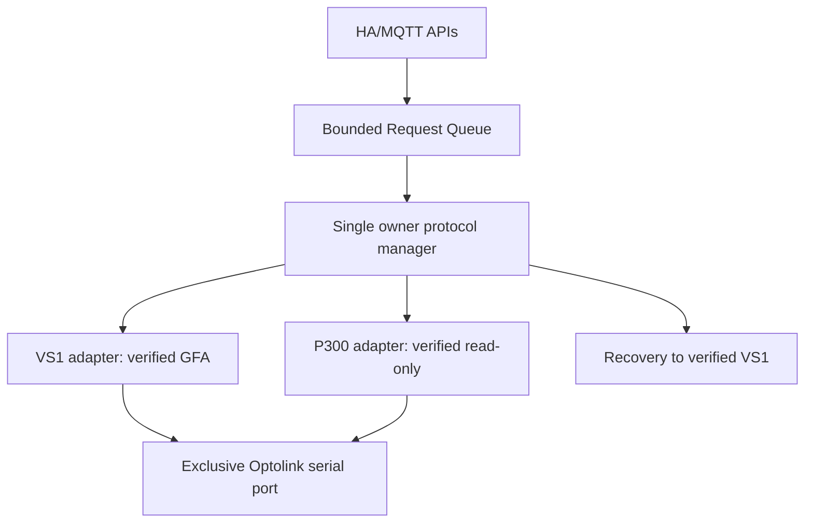
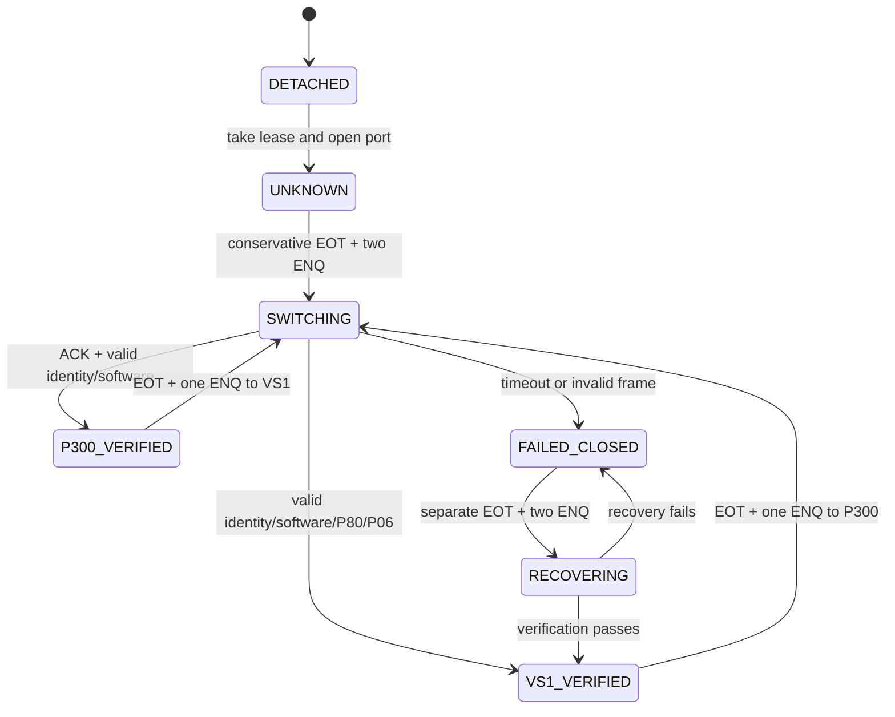

# VS1/P300 handover acceleration – Offline-Ursachenaudit (2026-10-09)

**Status:** Nur Offline-Forschung; kein Zugriff auf die Heizungssteuerung, kein produktiver Patch, kein RPM-Logger verändert. Neuer Branch basiert auf `optolink-splitter-ha@555528c5075315db0fd50fd17ee5dd3a806f67e0`, nicht auf PR #46. Der umfassende, lokal mit 23/23 Tests verifizierte Quellprototyp wird separat als Downloadarchiv ausgeliefert; die branchinterne Integration der vollständigen Module bleibt gesondert offen.

## Belegklassen

**Live-Messungen:** Vom Benutzer am 8.10. übergebene drei echte Konsolenmessrunden je Variante, in `optolink-p300-migration/docs/p300-goals-and-single-enq-result-2026-10-08.md`, `p300-handover-baseline-result-and-single-enq.md` sowie `p300-idle-enq-result-2026-10-08.md`. Nur Konsolendatensätze, keine originalen measurement.json-Dateien.

**Canary-Bericht:** `docs/p300-rpm-trigger-canary-audit-2026-10-09.md`: 231 Zyklen, 924 gültige P300-Frames, VS1→P300 2186 ms, P300→VS1 4323 ms. Das originale Tar-Archiv lag dieser isolierten Session nicht vor.

**Quellcode:** P300-Research-Branch `tools/wb2a-handover-probe.py`, `wb2a-p300-deep-logger.py`, `wb2a-p300-rpm-trigger.py`, `wb2a-p300-temporal-logger.py`, `wb2a-uart1-overnight.py`; Original-Upstream `philippoo66/optolink-splitter@c1ee204a1421447721603c5f21c6da7337fdac97` (`optolinkvs1.py`, `optolinkvs2.py`, `vs12_adapter.py`); privates Vitosoft-Originalcode-Derivat `Viessmann-Vitosoft-300-SID1/collector-output/20260925-vs1-process-read-trace/{VS1Message.cs,summary.json}` und dessen dokumentierte Provenienz.

## Gemessene vollständige EOT/Ein-ENQ-Runde (arithmetische Mittelwerte, n=3)

| Phase / Telegramm | ms | Einordnung und mögliche Einsparung | Risiko |
|---|---:|---|---|
| EOT 04; bis ENQ 05 beim P300-Einstieg | 1997,569 | Host-beobachtete Synchronisationswartezeit; keine bewiesene Firmware-Konstante. Potenziell nur durch *belegten* alternativen Zustandspfad entfernbar. | Kritisch |
| START 16 00 00 → ACK 06 | 13,227 | Serielle Leitung, Host, USB und Controller nicht getrennt; höchstens wenige ms plausibel. | Hoch |
| P300 FC01/00F8/2 Identität → 20C2 | 63,824 | Exakte Geräteprüfung, nicht entfallen lassen. | Kritisch |
| P300 FC01/778C/2 Software → 0103 | 91,493 | Exakte Softwareprüfung; 25-ms-Gaps und 10-ms-Quiet enthalten. | Kritisch |
| EOT 04; bis ENQ 05 beim VS1-Rückweg | 1997,891 | Zweiter Hauptengpass; Herkunft nicht isoliert. | Kritisch |
| STX 01 F7 00 F8 02 → 20C2 | 31,533 | Sichere frische VS1-Identität, geringe Einsparung. | Kritisch |
| GFA-Block 6B/4050,4006,4009,4057 | 414,499 | Teils hostseitige Guards; FF-Retry-Rate unbekannt; ohne Frischeverlust bündeln. | Hoch |
| **Gesamt** | **4610,091** | **3995,460 ms (86,7 %) entfallen auf die beiden ENQ-Warten.** | — |

Baseline mit zwei ENQs auf Rückweg: **6862,980 ms** (zusätzlicher ENQ **2237,679 ms**), gegenüber Ein-ENQ **2252,889 ms / 32,827 % reale Einsparung**. Drei Runden nach Ein-ENQ mit gültiger ID, P80=20, weiteren GFA-Rohantworten und wiederhergestelltem produktiven VS1. Natürliches ENQ ohne EOT: **5628,235 ms**, also **1018,145 ms langsamer**. Nicht unverändert wiederholen.

Bei 4800 Baud, 8E2 sind 12 Bits je Zeichen bzw. 2,5 ms pro Byte zu übertragen; einzelne Kontrollbytes erklären keine zwei Sekunden. `wb2a-handover-probe.py` verwendet `timeout=0`, 1-ms-Polling bei leeren Reads, `write_timeout=1`, `exclusive=True` und `TIOCEXCL`. Service-Stopp, Portöffnen und Cold-Setup liegen außerhalb des gemessenen kompletten Vergleichs. `optolinkvs1.wait_for_05()` dagegen pollt nach `sleep(.1)`, ebenso `optolinkvs2.init_vs2()`. Dies kann lokale Reaktionslatenz erhöhen, erklärt aber nicht die zwei fast genau 2-s-Phasen des anderen Messhelfers. `SYNC_TIMEOUT=.6` ist Host-Sitzungslogik, kein Beleg für Controller-Timing.

Die Research-Logger verwenden bewusst weiter `DeepWire.identify_vs1(): self.w.enter_vs1(2)` und dürfen während laufender RPM-Forschung nicht geändert werden. `UART1Wire.record()` fasst mehrere RX-Bytes bis zum nächsten TX zusammen und versieht sie mit dem Zeitpunkt des **ersten** RX-Bytes; `RX 060505` bedeutet keine simultane Ankunft. Der 4,323-s-Rückweg im Canary ist mit dem konservativen Zwei-ENQ-Design vereinbar.

## Technische Untergrenzen

Für **<4 s** fehlen >610,1 ms, für **<2 s** >2610,1 ms, für **<1 s** >3610,1 ms gegenüber der identitätsgeprüften vollständigen 4,610-s-Runde. Das bloße Ersetzen von 100-ms-Polling durch Ereignislesen reicht dafür nicht. Nur ein unabhängig belegter schneller Synchronisationspfad oder das dauerhafte Vermeiden der Protokollwechsel durch eine **wirklich** äquivalente P300-GFA-Quelle könnte die Hauptwartezeiten wegnehmen. Kein solcher Hardwarebeleg existiert.

## Vitosoft-Originalcode

`VSKOStart` konserviert Handler-/Queue-/Timer- und Interfacezustand und führt `VSManager.ChangeInterface(VS1)` aus. `VSKOStop` stellt das zuvor gespeicherte Interface wieder her. Abstraktes `GFA_READ=0xC9` wird im VS1-Serializer auf Wire-Opcode `0x6B` abgebildet. Der Versuch mit echtem P300-Wire-`C9` an 4050 wurde abgelehnt (Message 3, Payload 05). Unter P300 können Funktionsbits/Sequenzbits zusammenfallen (`C9 & 0x1F=09`); ein Wechsel auf `09` oder `6B` im P300-Frame ist weder begründet noch freigegeben. P06-Rohdrehzahl darf weder durch P09-Modulationssollwert, P10-PWM noch alte RAM-/RX-Kopien ersetzt werden.

## Entscheidung

**Single-Owner-Protokollmanager + dünne VS1/P300-Adapter** als offlinesimulierte Forschungsarchitektur, zunächst **kein Gesamtfork**. Der Besitzer serialisiert Transaktionen, hat explizite Zustände, begrenzte Wartezeiten, feste erlaubte Read-only-Frames, exklusive Portverwaltung und Frischezeiten pro Kanal. Eine in derselben ununterbrochenen Phase **aktuell verifizierte** VS1-Sitzung kann für weitere GFA-Leseoperationen verwendet werden; nach EOT/Protokollwechsel keinesfalls alte Verifikationen wiederverwenden.

**VS1-Grundmodus + seltene P300-Diagnosefenster** ist für die aktuelle Produktion die plausiblere Entwicklungsoption. Ein P300-Grundmodus mit regelmäßigem VS1-GFA-Fenster wäre zu langsam für den diskutierten asynchronen RAM-Reload (~2,1 s), selbst mit einem validen schnelleren VS1-Rückweg. Fork sinnvoll **erst**, wenn die HA-Integration des Single-Owner-Managers nicht anders wartbar wird; Fork ersetzt keine Gerätetimer.

## Offline-Implementierung und Teststand

Der **unabhängige Forschungsbranch** enthält jetzt ausführbare, aber bewusst
hardwarelose Komponenten:

- `tools/handover_acceleration/coordinator.py`: explizite Handshakezustände,
  feste Read-only-Freigabelisten auch auf Wire-Ebene, Geräte- und
  Softwareidentität, P80/P06-Prüfung, konservativer Einmal-Restore.
- `tools/handover_acceleration/scheduler.py`: begrenzte und typisierte
  Read-only-Queue, begrenzte Protokoll-Batches, Cancellation nur vor
  einem begonnenen Frame, Frischemodell mit Quellen-/Sitzungsnachweis.
- `tests/test_handover_acceleration.py`, `test_handover_pty.py`,
  `test_handover_scheduler.py`, `test_handover_latency_budget.py`:
  **51/51 Offline-Tests erfolgreich**; Linux-PTY ist ein virtueller
  Kerneltransport und kein Test der echten seriellen Hardware.
- `.github/workflows/handover-acceleration-offline.yml`: CI auf Python
  3.11 und 3.12, beide erfolgreich beim Commit `713a97c3`
  ([Workflow](https://github.com/SaulGoodman1337/optolink/actions/runs/37973198847)).

**Nicht integriert und nicht freigegeben:** produktiver Dispatcher, echter
serieller Port, vollständige HA-Schreib- und Readback-Parität, unabhängiger
Recovery-Supervisor, echte USB/CP2102-Timings und Hardware-Beschleunigung.
Die Queue und der Frischeledger sind noch **nicht** mit dem
Protokollkoordinator verbunden. `flock` ist kooperativ und kann einen
Fremdprozess allein nicht verhindern. Weitere GFA-Adressen, P300-GFA-Aliase
und Writes bleiben gesperrt.

Der ergänzende [Integrationsaudit](handover-dispatcher-integration-audit-2026-10-09.md)
zeigt, dass der vorhandene produktive Splitter selbst bereits ein zentraler
serieller Besitzer ist. Ein späterer Manager sollte daher **innerhalb des
bestehenden Hauptloops** die serielle Transaktionsgrenze übernehmen,
nicht einen zweiten Portbesitzer starten. Die vorhandenen MQTT-/TCP- und
HA-Semantiken sind dabei unverändert zu erhalten.

Weitere Dokumentation:
[Phase 2: Wire-Guards und PTY](handover-acceleration-phase-2-2026-10-09.md),
[Phase 3: Queue und Datenfrische](handover-acceleration-phase-3-2026-10-09.md).

**Ein weiterer Hardwaretest wird nicht beantragt.** Erst eine neue
quellenbelegte Hypothese, eine definierte Offline-CI-Abnahme, ein
unabhängiger Recoverypfad und ausdrückliche Nutzerfreigabe können einen
späteren Versuch rechtfertigen.

## Quellenverweise

- [Handover-Prober](https://github.com/SaulGoodman1337/optolink/blob/optolink-p300-migration/tools/wb2a-handover-probe.py)
- [Ein-ENQ-Messwerte](https://github.com/SaulGoodman1337/optolink/blob/optolink-p300-migration/docs/p300-goals-and-single-enq-result-2026-10-08.md)
- [Zwei-ENQ-Messwerte](https://github.com/SaulGoodman1337/optolink/blob/optolink-p300-migration/docs/evidence/p300-handover-baseline-2026-10-08.json)
- [Idle-ENQ negativ](https://github.com/SaulGoodman1337/optolink/blob/optolink-p300-migration/docs/p300-idle-enq-result-2026-10-08.md)
- [Canary-Audit](https://github.com/SaulGoodman1337/optolink/blob/optolink-p300-migration/docs/p300-rpm-trigger-canary-audit-2026-10-09.md)
- [Vitosoft-GFA-Pfad](https://github.com/SaulGoodman1337/optolink/blob/optolink-p300-migration/docs/p300-gfa-host-trace-2026-10-08.md)
- [Original-Upstream](https://github.com/philippoo66/optolink-splitter/tree/c1ee204a1421447721603c5f21c6da7337fdac97)
- [pySerial API](https://pyserial.readthedocs.io/en/latest/pyserial_api.html)
- [OpenV KW](https://github.com/openv/openv/wiki/Protokoll-KW) und [P300](https://github.com/openv/openv/wiki/Protokoll-300)
