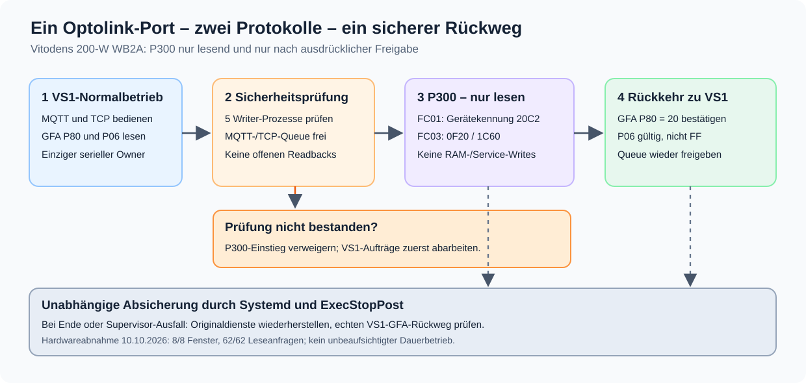

# Optionaler VS1/P300-Protokollwechsel

Der produktive **Vitodens 200-W WB2A / VDensHO1 / 20C2** wird standardmäßig
über das Optolink-Protokoll **VS1** ausgelesen. Die optionale Funktion
`optolink-hybrid` ermöglicht auf ausdrückliche Anforderung ein
**zeitbegrenztes, ausschließlich lesendes P300-Fenster** mit anschließendem
Rückwechsel zu VS1. Die Funktion ist kein zweiter serieller Treiber und
kein zusätzlicher Portbesitzer.



## Geltungsbereich und Stand

- **Standard:** ursprünglicher VS1-Splitter; keine permanente P300-Automatik.
- **Optional:** drei überwachte VS1→P300→VS1-Fenster mit
  `RuntimeMaxSec=270` und unabhängiger Rückfallroutine.
- **P300-Transaktionen:** FC01-Geräteidentität (`20c2`) und
  FC03-Lesen von `0x0F20/32` sowie `0x1C60/32`.
- **Nicht vorgesehen:** Controller-Schreibvorgänge über P300,
  direkte RAM-Veränderungen, Dienstprogramme für Rohwrites und
  die Ableitung einer vermeintlich verifizierten P300-Gebläsedrehzahl.
- **Abnahme:** Am 10.10.2026 waren acht automatische, lesende
  Hardwarefenster erfolgreich. Gleichzeitig bestanden 31/31 MQTT-
  und 31/31 TCP-GFA-Leseanfragen. Ein gezielter SIGKILL des
  *separaten Canary-Supervisors* löste den unabhängigen Systemd-Rollback
  aus. Diese Tests ersetzen **nicht** einen Hardware-Abbruch mitten
  in einem P300-Telegramm oder eine Freigabe für produktive P300-Writes.

Die historischen Versuchsberichte und die P300-RPM-Auswertung
liegen auf dem Branch
[`optolink-research`](https://github.com/SaulGoodman1337/optolink/tree/optolink-research).
Der Produktionsbranch enthält lediglich die dafür nötige,
reproduzierbar installierbare Laufzeit und Sicherheitsprüfungen.

**Neue, standardmäßig deaktivierte Entwicklungsstufe:** Der auf VS1
aufbauende [bedarfsgesteuerte P300-Lesebatcher](wb2a-on-demand-p300-design-2026-10-10.md)
wurde offline mit dem bestehenden Admission-Gate und simuliertem Port sowie
am 10.10.2026 [in einem einmaligen Hardwarecanary](wb2a-on-demand-canary-2026-10-10.md)
getestet. Ein zeitlich auf **ein Read-only-P300-Diagnosefenster** begrenzter
Shadow-Test bestand inklusive Original-VS1-P80/P06 und unabhängigem Systemd-
Rollback. Die Funktion bleibt **standardmäßig deaktiviert**; weder eine
allgemeine MQTT-/TCP-P300-API noch P300-Writes sind freigegeben.
Der Standardbetrieb bleibt unverändert.

## Installation über `update`

Der normale Installer installiert aus der gewählten Repository-Revision:

- `/usr/local/bin/optolink-hybrid` (Aufruf auch über `/usr/bin/optolink-hybrid`);
- die explizit freigegebenen Module unter
  `/usr/local/lib/optolink-hybrid/handover_acceleration/`;
- **keinen** permanenten Hybrid-Systemd-Dienst und **keine**
  automatische Protokollumschaltung.

Während eines aktiven Hybrid-Canarys verweigert das Update die
Übernahme der Bibliotheken. Der Profil-Installer aktualisiert
zunächst wie bisher die VS1-Laufzeit; erst danach werden
die optionalen Module bereitgestellt.

Nach einem Update gilt weiterhin: **Die normale Heizung wird
ausschließlich über VS1 betrieben.**

## Bedienung

Alle folgenden Befehle werden im bestehenden LXC-Container ausgeführt.
Die Vorbereitung und der Hardwaretest benötigen Root-Rechte.

### 1. Zustand kontrollieren

```bash
optolink-hybrid status
systemctl is-active optolink-splitter.service
```

Die Statusausgabe zeigt Originaldienste und Timer, den
`optolink-hybrid-continuous-canary.service`, die Writer-Sperre
und eventuell vorhandene vorbereitete Releases. `status` löst
keinen Protokollwechsel aus.

### 2. Geprüften Kandidaten vorbereiten

```bash
sudo optolink-hybrid vorbereiten --kennung hybrid-freigabe-01
```

Dabei werden die aktuelle, tatsächlich installierte VS1-Hauptquelle
und die fünf bekannten Writer-Quellen gelesen. Daraus entsteht
ein eigener, SHA256-gebundener Laufzeitkandidat unter:

```text
/var/lib/optolink-hybrid/releases/hybrid-freigabe-01/
```

Die Produktivquellen unter `/opt/optolink` werden **nicht**
durch diese Vorbereitung überschrieben. Ein bereits vorhandener
Release-Name kann nicht wiederverwendet werden.

### 3. Sicherheitsprüfung

```bash
sudo optolink-hybrid pruefen hybrid-freigabe-01
```

Die Vorprüfung bestätigt die Release-Hashes, die Originaldienste,
die nicht aktive Pumpenoverride-Einheit und echte VS1-GFA-Antworten
(P80=`20`, P06 ungleich `FF`). Es werden keine Schreibbefehle
ausgegeben und kein Systemd-Override aktiviert.

### 4. Explizit freigegebenes, überwachtes P300-Lesefenster

```bash
sudo optolink-hybrid testen hybrid-freigabe-01 \
  --telemetriepause-bestaetigt
```

Der Test pausiert zeitweise die reguläre Telemetrie, installiert
temporäre Systemd-Overrides ausschließlich für die aktuelle Session
und weist alle fünf produktiven Schreibdienste mit
Dateihashes, Prozessen und gemeinsamen Sperrmechanismen nach.

Vor dem P300-Einstieg müssen die normale MQTT-/TCP-Warteschlange,
vorgemerkte Leseverifikationen sowie die externen Writer frei sein.
Wenn nicht, wird der Einstieg verweigert oder verschoben.

Während des P300-Fensters besitzt weiterhin allein der bestehende
Splitter den seriellen Anschluss. Die MQTT-/TCP-Eingänge werden
gegen unzulässige Paralleltransaktionen gesichert.

Nach dem Fenster werden echte VS1-GFA-P80/P06-Werte geprüft.
Einzelne gesicherte Anfragen bleiben bis zur Rückkehr gepuffert;
fehlgeschlagene oder unbestätigte Writer-Transaktionen gelten
ausdrücklich nicht als erfolgreich.

Am Ende entfernt `ExecStopPost` die temporären
Overrides und stellt die ursprünglichen VS1-Dienste wieder her.
Dieser Rückweg ist von einem intakten Python-Canary-Supervisor
unabhängig. Ein Test-Exitcode ungleich null **ist kein
erfolgreich bestätigter VS1-Rückwechsel**.

## Sicherheitsregeln

1. Ein physischer Optolink-Port, ein serieller Hauptprozess.
2. Die fünf anderen schreibfähigen Dienste dürfen den Port
   nicht selbst öffnen; sie verwenden MQTT und die gemeinsame
   Writer-Lease.
3. Ein ausstehender MQTT-/TCP-Schreibauftrag oder Readback blockiert
   den P300-Einstieg.
4. Ein unerwarteter Abbruch mit persistierendem `P300_ACTIVE`,
   `P300_FAILED` oder `FAILED:...` muss **zunächst untersucht
   werden**. Sperrdateien niemals manuell leeren, nur um einen
   weiteren Versuch zu ermöglichen.
5. Nur vollständig geprüfte, root-eigene Release-Dateien aus
   `/var/lib/optolink-hybrid/releases/` sind als Systemd-Laufzeit
   zulässig. Keine Symlinks, kein in-place Patch am Produktivcode.
6. Wenn nach dem Rückfall keine gültigen P80-/P06-Werte gelesen
   werden können: **keine weiteren Experimente**, Originalzustand
   mit Journal und Recovery-Berichten prüfen und den Fehler beheben.
7. Keine P300-Schreibfreigabe aus einem bestandenen Lesetest ableiten.

## Diagnose und Wiederherstellung

```bash
systemctl status optolink-splitter.service --no-pager
systemctl status optolink-hybrid-continuous-canary.service --no-pager
journalctl -u optolink-hybrid-continuous-canary.service -n 80 --no-pager
journalctl -u optolink-splitter.service -n 80 --no-pager
optolink-hybrid status
optolink-debug request 'gfaread;0x4050;1;raw;False' --timeout 10
optolink-debug request 'gfaread;0x4006;1;raw;False' --timeout 10
```

Sitzungsbezogene Messungen und Recovery-Berichte liegen unter
`/var/lib/optolink-hybrid/canary-sessions/run-.../`.
Ein erfolgreicher Rückfall enthält
`PASS_ORIGINAL_SERVICES_RESTORED` und eine echte gültige
VS1-GFA-Prüfung.

Die gesondert durchgeführten Tests belegen einen **SIGKILL des
Canary-Supervisors**, nicht den vollständigen Ausfall des seriellen
Hauptprozesses während `P300_ACTIVE`. Für eine dauerhaft aktivierte
P300-Automatik und für Controller-Schreibtransaktionen sind weitere
separate Freigaben notwendig.

## Branches und Aktualisierung

Der Produktivcode sowie diese Anleitung gehören zu
`optolink-splitter-ha` und nach dem geprüften Release-Merge auch
zu `main`. Forschungsbeobachtungen werden separat auf
`optolink-research` aufbewahrt.

Der Befehl `update` liest seinen Bezug aus
`/etc/community-scripts-private.conf`, insbesondere aus
`COMMUNITY_SCRIPTS_REF`. Ein Merge nach `main` ändert diesen
lokalen Eintrag **nicht automatisch**. Vor der Umstellung auf
`main` müssen dessen Release und die nicht gepufferten
lokalen `/opt/optolink`-Änderungen geprüft und gesichert sein.

Siehe [Betrieb](operations.md) und
[Architektur](architecture.md) für den vollständigen
Produktions- und Updatepfad.
